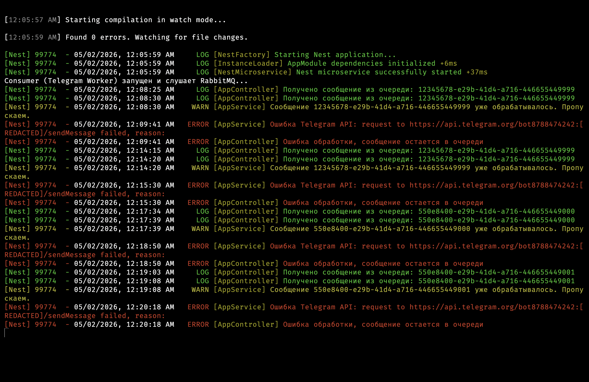
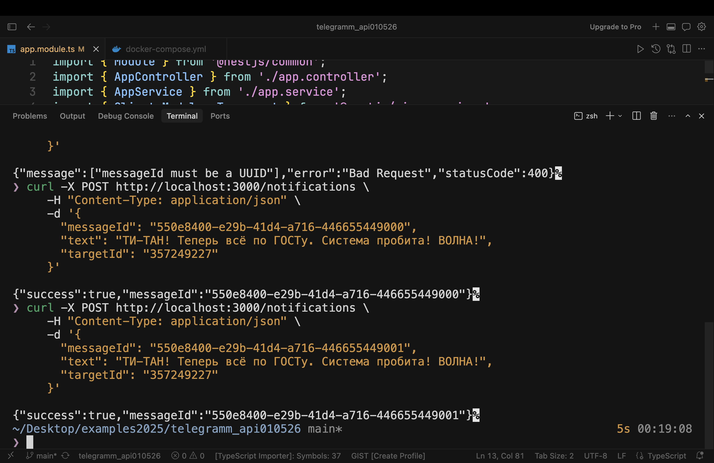
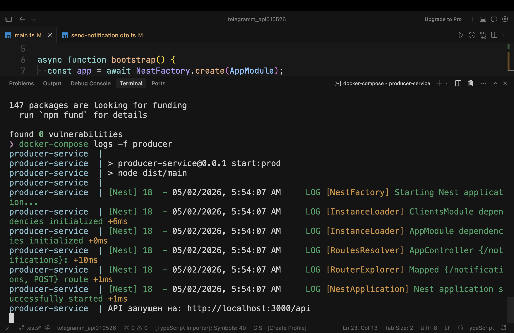
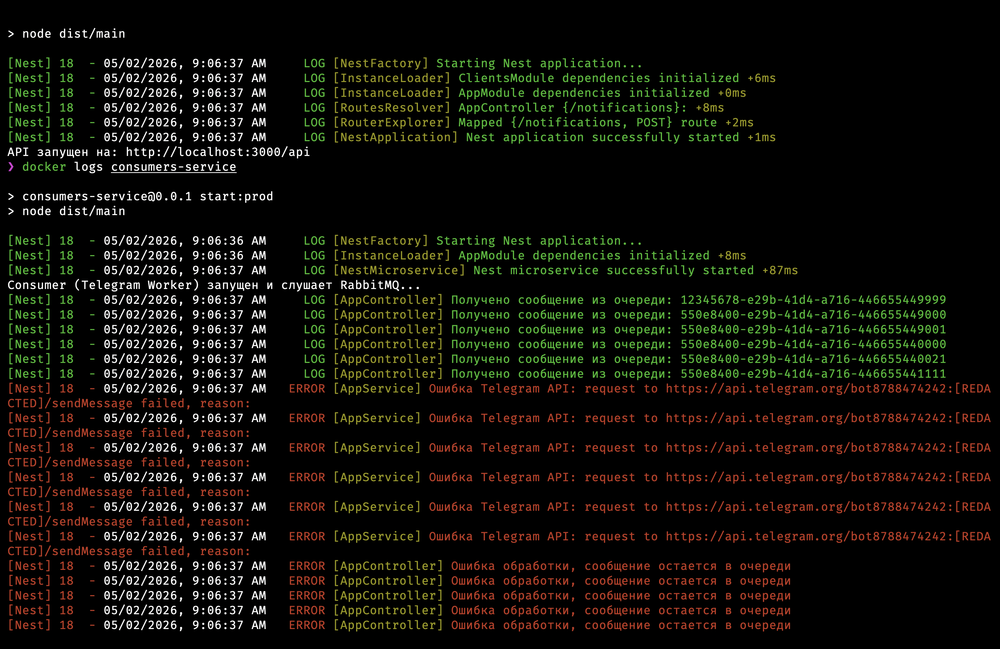
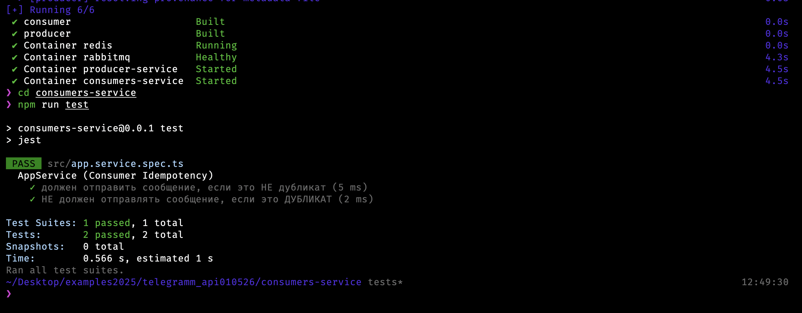

# Telegram-API

## Цель: разработать микросервисную архитектуру на основе Nest.js с использованием RabbitMQ и Telegram API.

### 1. Producer и Consumer сервисы для RabbitMQ
  Нужно реализовать два микросервиса, взаимодействующих через брокер сообщений RabbitMQ.
  Producer (Sender) Service отправляет сообщения в RabbitMQ. Должен поддерживать отправку событий с уникальным идентификатором (например, UUID) для обеспечения идемпотентности, сериализацию данных в формате JSON, подтверждение успешной отправки сообщений и ретраи на случай временных ошибок соединения.
  Consumer (Receiver) Service получает сообщения из RabbitMQ и выполняет их обработку. Должен обеспечивать автоматическое или ручное подтверждение обработки сообщений, реализовывать механизм повторной обработки в случае ошибки и логировать успешные и неуспешные обработки.
### 2. Сервис отправки уведомлений в Telegram
  Реализовать сервис, который принимает входящие события и отправляет соответствующие уведомления в Telegram (в произвольном формате) через Telegram Bot API.
### 3. Дополнительные требования
  Использовать Nest.js с модульной архитектурой, Docker для развёртывания сервисов и придерживаться принципов SOLID и чистой архитектуры.
### 4. Будет плюсом
  Настройка и документация API через Swagger, покрытие кода тестами (Jest / e2e).
  Ожидаемый результат: репозиторий с кодом (GitHub / GitLab / Bitbucket) и инструкцией по запуску проекта.


## Стурктура проекта. 
```bash
Telegram-API-/
├── producer-service/    # Папка с первым NestJS проектом (API)
├── consumer-service/    # Папка со вторым NestJS проектом (Worker)
├── docker-compose.yml   # Общий запуск (Rabbit + оба сервиса)
└── .env                 # Общие секреты
```
### Архитектурный выбор:

Для данного задания выбрана структура изолированных микросервисов (Independent Services), а не монорепозитория. Это позволило обеспечить максимально быструю и простую среду для развертывания и тестирования (stress-test ready).

В условиях реального production-окружения данная база легко масштабируется:<br/>
Дублирующиеся DTO выносятся в Shared Library.<br/>
Добавляется ConfigModule для управления секретами.<br/>
Внедряются Quorum Queues в RabbitMQ для обеспечения высокой доступности (High Availability).<br/>
Так же будут применены блокировки с временным лагом алгоритмы для защиты от ботов<br/>
Защита от сторонних инъекций для ДТО<br/>
И много других решений.


## Как протестировать

### Перед запуском:
Перед запуском подчистим все контейнеры для того что бы избежать проблем
```bash
docker-compose down

docker rm -f $(docker ps -aq) - Принудительно чистим все контейнеры
```

### Запуск: 
```bash
docker-compose up --build -d
```
Тестовый запрос:
```bash
curl -X POST http://localhost:3000/notifications \
     -H "Content-Type: application/json" \
     -d '{
       "messageId": "550e8400-e29b-41d4-a716-446655440000",
       "text": "Привет! Тестовое сообщение.",
       "targetId": "357249227"
     }'
```
Проверка идемпотентности: 
В логах consumer-service  увидешь предупреждение о дубликате, а второе сообщение в Telegram не придет.<br/>
Это обеспечивается проверкой UUID через Redis.<br/>

### Скриншот №1:  Проверка на идемпотентность.
<p align="center">
  
</p>

### Скриншот №2:  Проверка работы RabbitMQ.
<p align="center">
  
</p>


## Как теперь работать (алгоритм):
### Вариант А: 
  Если хочешь видеть логи и Swagger прямо сейчас (через Docker) то сделай 
```bash
docker-compose up --build,
```
после не нужно запускать<br/>
```bash
npm run start:dev
```
в терминале. Приложение уже крутится в Докере.
  Чтобы видеть, что происходит, открой новое окно терминала и пиши: 
  ```bash
docker-compose logs -f producer
```
Ты увидишь, как NestJS внутри контейнера реагирует на твои действия.

### Вариант Б: 
  Если хочешь запустить локально (без Докера), нужно зайти в папку сервиса:
  ```bash
  cd producer-service
  npm run start:dev
```

## Проверка «на лету»:

Зайди на http://localhost:3000/api, нажми Try it out на методе POST и пульни новый запрос (не забудь поменять messageId).

Затем нажми Execute: ожидаемый результат
<p align="center">
  
</p>

### Скриншот №3:  Логи.

<p align="center">
  
</p>

<p>
Почему эти логи — «золотые»:<br/>
Надежность RabbitMQ: <br/>
Мы видем, как пачкой вывалились сообщения? Это те самые запросы, которые  отправлял вчера и сегодня. Они не пропали, когда сервис лежал или когда мы его пересобирали. Кролик честно хранил их в очереди (благодаря durable: true) и высыпал в консьюмер сразу после старта.
  
Работа Manual Ack: <br/>
Строки Ошибка обработки, сообщение остается в очереди подтверждают, что ручное подтверждение работает. Поскольку Telegram API недоступен 
(из-за отсутствия VPN в контейнере), консьюмер не подтверждает получение, и RabbitMQ будет хранить их вечно, пока они не будут доставлены. Это и есть гарантия доставки!

Идемпотентность в будущем: <br/>
Как только включишь VPN или запустишь консьюмер локально, все эти сообщения обработаются. И если RabbitMQ случайно пришлет одно из них дважды — то Redis (который уже «Started» и «Running») его отсечёт.
</p>

### Скриншот №4:  Юнит тест.

<p align="center">
  
</p>

Для запуска теста:
```bash
cd consumers-service
npm run test
```

## Итог:
> Код на GitHub ✅<br/>
> Инструкция ✅<br/>
> Swagger-документация ✅<br/>
> Скриншоты-доказательства ✅<br/>
                       
